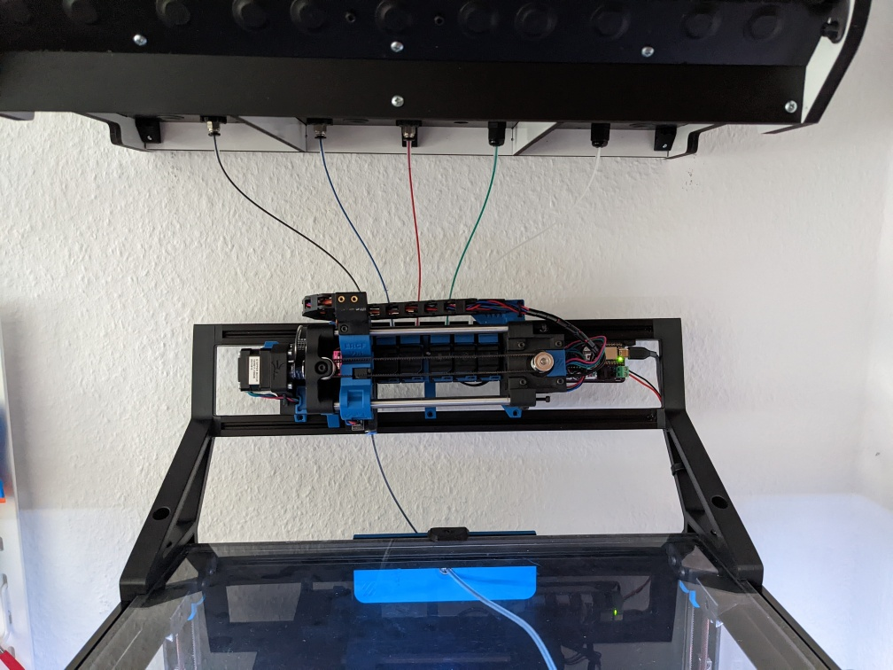
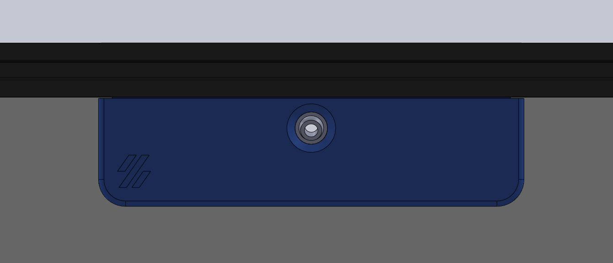
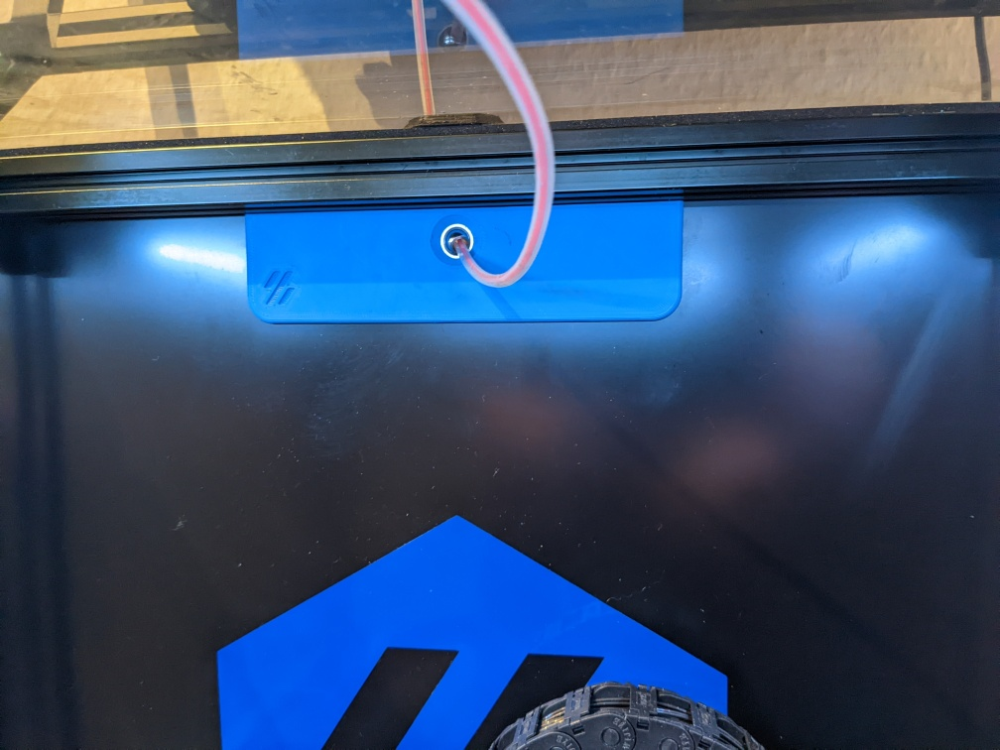
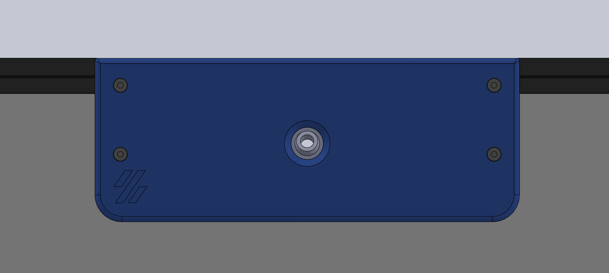
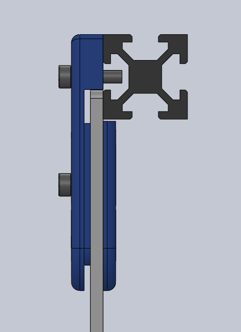

# exhaust filament feed ge5c

flexible filament feed that utilises a ge5c spherical bearing

using it in combination with the ERCF to reduce the friction when printing from different spools

## pictures

- top view

- inside view

- outside view

- side and split from side view

## print

flat without supports
