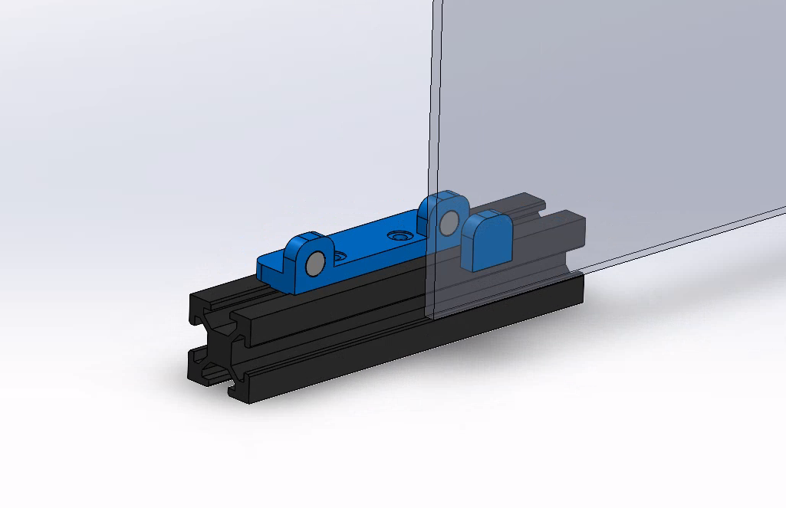
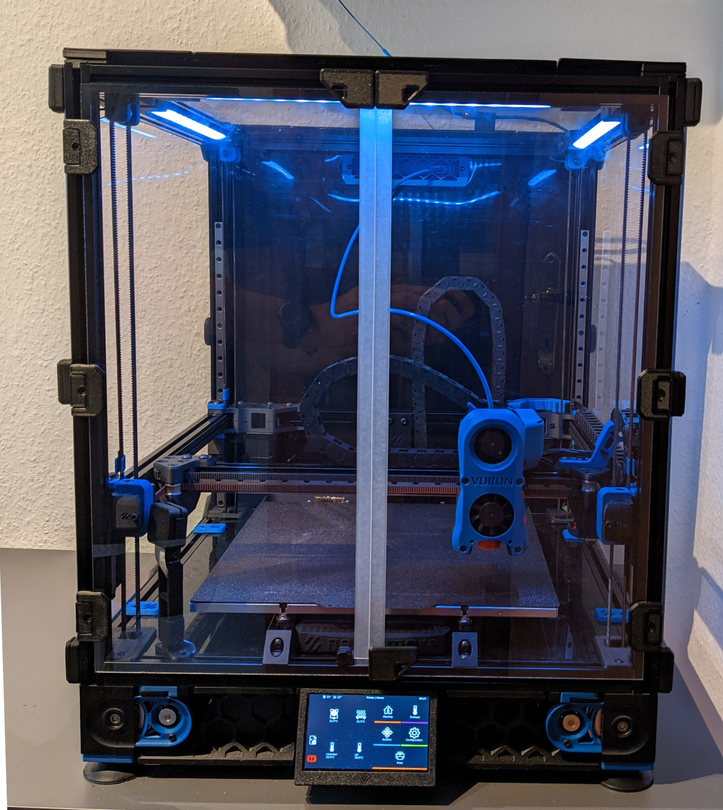
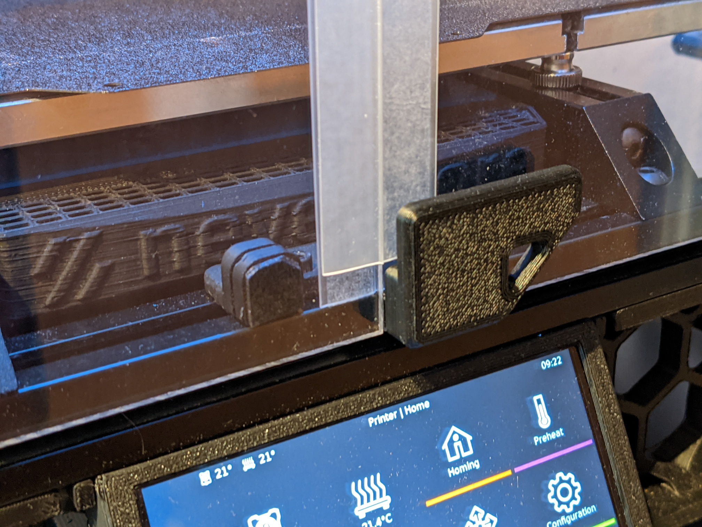

# inside door magnets

since installing a nevermore micro and using sealing strips to keep (a little) more air in the
chamber, the magnet doors did not work so well anymore.
stl and solidworks files are available for use and further optimization.

## pictures

## print

- 2 inside_magnets
- 1 inside_mount

## necessary parts

- 4 x 6x3mm magnets
- 2 x 8mm M3 SHCS
- 2 x 2020 M3 t-nuts
- a little vhb tape
- 1m sealing strips, transparent, 25mm e.g. from [amazon](https://www.amazon.de/gp/product/B094NG3497/ref=ppx_yo_dt_b_asin_title_o04_s01?ie=UTF8&psc=1)

## assembly

- install magnets, maybe use some superglue
- screw inside_mount to the extrusion
- use small vhb patches to the magnets
- attach magnets to the mounts
- close doors
- fine-tune the alignment
- reverse one of the default door handles, remove the other
- attach sealing strips
