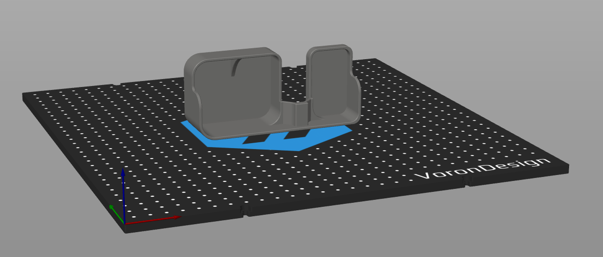

# kinetic purge bucket

based on 
- [original mod by edwardyeeks](https://github.com/VoronDesign/VoronUsers/tree/master/printer_mods/edwardyeeks/Decontaminator_Purge_Bucket_%26_Nozzle_Scrubber) [1]
- [mod by
  mikhailbot](https://github.com/mikhailbot/VoronMods/tree/main/Decontaminator-Purge-Bucket) [2]
- [kinetic mod by dfdye](https://github.com/Dfdye/Voron_Mods/tree/main/Purge_Bucket_for_WP_Kinetic_Mount) [3]

modified [2] after seeing [3] and installing the kinetic bed mounts from https://github.com/tanaes/whopping_Voron_mods/tree/main/kinematic_bed

## pictures

Design in SolidWorks

STL in SuperSlicer

## print

- print standing upwards
- mirror if necessary (defaults to left-mounted bucket)

## assembly

- install magnets, maybe use some superglue
- use brush mount spacer from [3]
