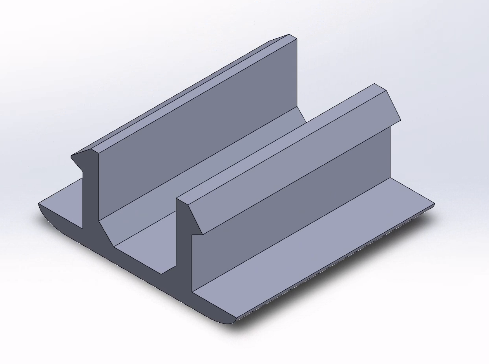

# profile-2020-cover

wanted to route some cables through the 2020 profiles and found no cover that worked as I wanted it
to, so I designed a new one.
stl and solidworks files are available for use and further optimization.

## pictures

## print

scale to match your desired length

